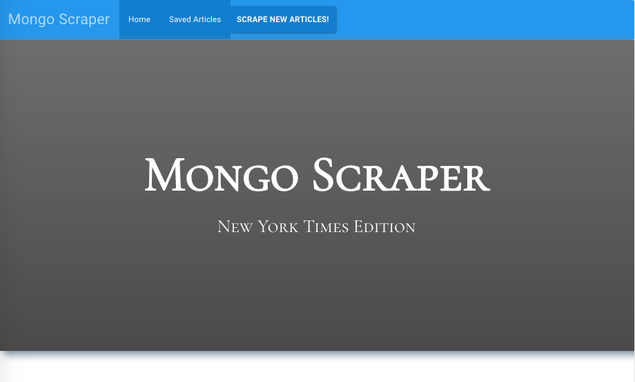
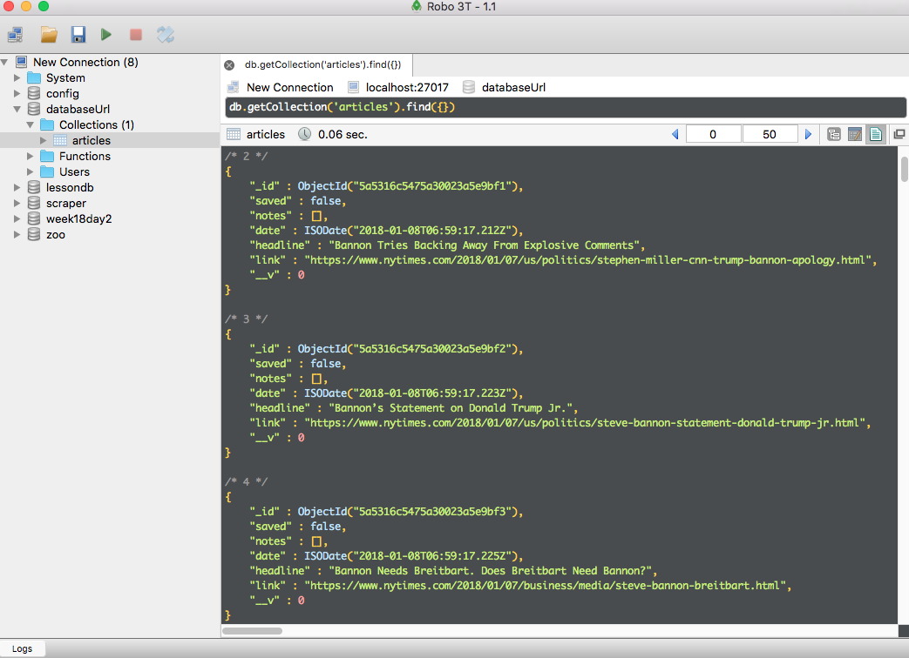
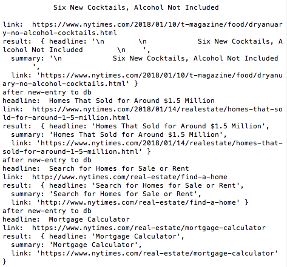
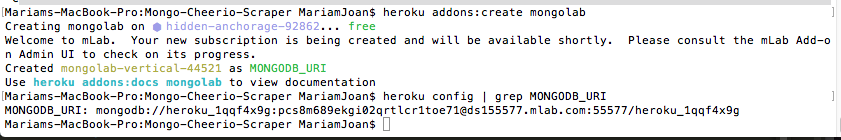

# Mongo-Cheerio-Scraper

## Overview
Here I created a web app that lets users view and leave comments on the latest news using Mongoose and Cheerio to scrape news from the New York Times. Technologies used are Express, Handlebars, Mongoose, Cheerio.

Check out [my demo](http://mongo-newyorktimes-scraper.herokuapp.com/) to study the app's basic functionality. This demo is deployed on Heroku using mLab which works as a remote MongoDB!






These were the steps I took to provision mLab on Heroku and get it running:

1. Create a Heroku app in your project directory.
2. Run this command in your Terminal/Bash window:
    * `heroku addons:create mongolab`
    * This command will add the free mLab provision to your project.
3. You'll need to find the URI string that connects Mongoose to mLab. Run this command to grab that string:
    * `heroku config | grep MONGODB_URI`
    * Notice the value that appears after `MONGODB_URI =>`. This is your URI string. Copy it to a document for safekeeping.
4. When you’re ready to connect Mongoose with your remote database, you'll need to add it as an [environment variable on Heroku](https://devcenter.heroku.com/articles/config-vars)

* As a reminder, you can check for the environment variable and fall back to a local mongo server:
```
// If deployed, use the deployed database. Otherwise use the local mongoHeadlines database    
`var MONGODB_URI = process.env.MONGODB_URI || "mongodb://localhost/mongoHeadlines";`
```
* Then, just pass the `MONGODB_URI` variable to `mongoose.connect`. If you define `MONGODB_URI` on heroku, your production app will automatically use the remote database
* You shouldn't connect to the remote database when developing locally. Your classroom's network may
not function if you do (but it's also best practice to use a local databse for development).

## Process
* Create an app that accomplishes the following:
  1. Whenever a user visits your site, the app should scrape stories from a news outlet of your choice and display them for the user. Each scraped article should be saved to your application database. At a minimum, the app should scrape and display the following information for each article:
     * Headline - the title of the article
     * Summary - a short summary of the article
     * URL - the url to the original article
     * Feel free to add more content to your database (photos, bylines, and so on).
  2. Users should also be able to leave comments on the articles displayed and revisit them later.
  3. The comments should be saved to the database as well and associated with their articles. Users should also be able to delete comments left on articles. All stored comments should be visible to every user.

### Helpful Links
* [MongoDB Documentation](https://docs.mongodb.com/manual/)
* [Mongoose Documentation](http://mongoosejs.com/docs/api.html)
* [Cheerio Documentation](https://github.com/cheeriojs/cheerio)

- - -

##### Copyright
##### Coding Boot Camp (C) 2016. All Rights Reserved.
